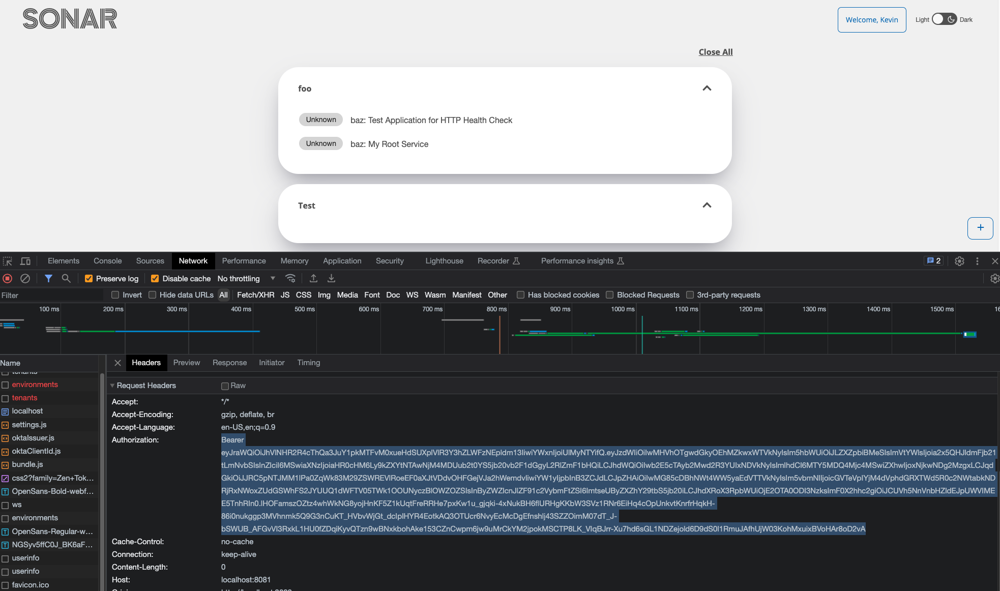
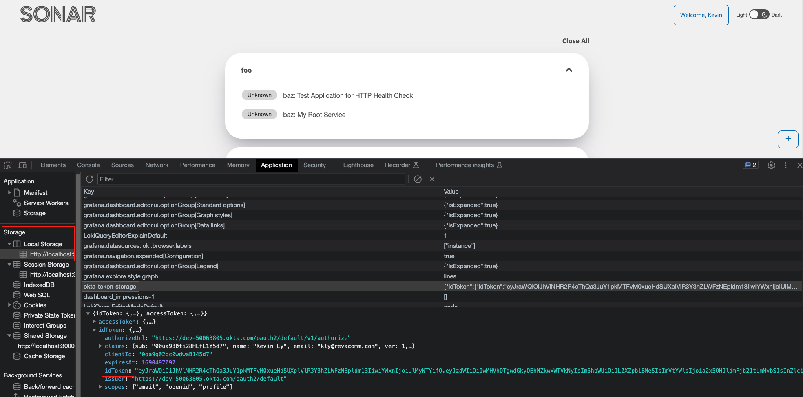
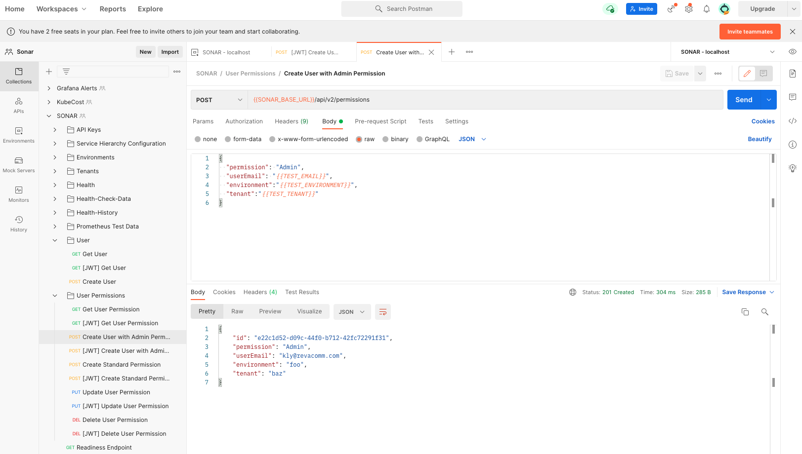
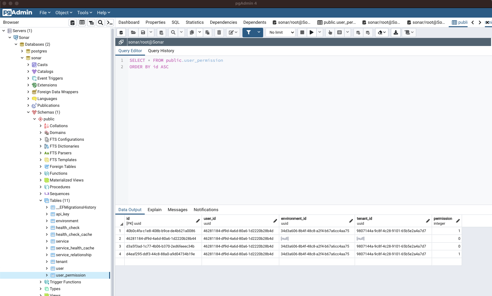

# User Permissions

SONAR utilizes Okta as its Single Sign-On provider. In order to authenticate users both the UI and API must interact with Okta’s authorization server. The authorization server provides verification and configurable claims in the form of Jason Web Tokens. The configuration can be found under the Security Dropdown under API. Claims can be modified by selecting the authorizing server and modifying parameters under the claims tab.

## Pointing to Okta Authorization Server on the API.

The simplest way to modify the Authorization Server access point on the API is to modify the corresponding environment variables within appsettings to point to our Developer Okta instance use the following:
```
    "OktaDomain": "https://dev-50063805.okta.com",
    "AuthorizationServerId": "default",
    "Audience": "0oa9q02oc0wdwaB145d7"
```
## Pointing to Okta Authorization Server on the UI.

The UI has a build in command to inject environment variables. Alternatively you can modify the `OKTA_ISSUER` and `OKTA_CLIENTID` configuration files if need be.
```
REACT_APP_OKTA_ISSUER="https://dev-50063805.okta.com/oauth2/default" REACT_APP_OKTA_CLIENTID="0oa9q02oc0wdwaB145d7" npm start
```
## Obtaining and Using JWTs

JWT can be obtained by first logging into the SONAR UI application and viewing the network tab or the Application tab. Note: The tokens provided by the Dev Okta instance has an expiration time of one hour.

### Network Tab



In any of the API calls, view the Request Headers and see the Authorization parameter.

### Application Tab



Navigate to the application tab, expand Storage and click on “okta-token-storage”. Lastly expand idToken and copy the JWT in the idToken parameter.

## Using JWTs in SONAR

JWT can be decoded using the free JWT online service at https://jwt.io/. Decoding allows for viewing of user profile information and claims that were set up in the Okta dashboard. JWT can also be used to authenticate user requests in any transactional request.

See Postman collection [Gitlab](https://code.batcave.internal.cms.gov/ado-repositories/oit/waynetech/sonar/-/tree/main/docs) or [Postman Collection](./)

To use the Postman collection the collection and environments. Under Environments, “SONAR - localhost” modify the ACCESS_TOKEN parameter with a valid token obtained above.
Refer to [Testing with Postman](../sonar-api/README.md)
### Prerequisites

Users must be created by providing a valid JWT to the API. Once a request is sent, SONAR API will verify and create users based on these claims. The simplest method to add a user is by logging into SONAR UI.

**Note:** API Keys provide full admin access whereas JWT access permission will be based on existing user permissions.

### Via Postman

User permissions can be modified by using Postman to manipulate the User Permissions table. Provided the valid authorization, users can create user permissions using the userEmail as the identifier and update/delete permissions using the generated GUID. Please note that user must already exist in the Users table for permissions to be added/update/modified/deleted.



### PGAdmin or similar

User permissions by also be modified by directly modifying the postgresql database by accessing the User Permission table and filling out each field respectively. Permission Value “0 - Admin”, “1 - Standard” and “Global Admin - Admin with Environment and Tenants set to null”.

