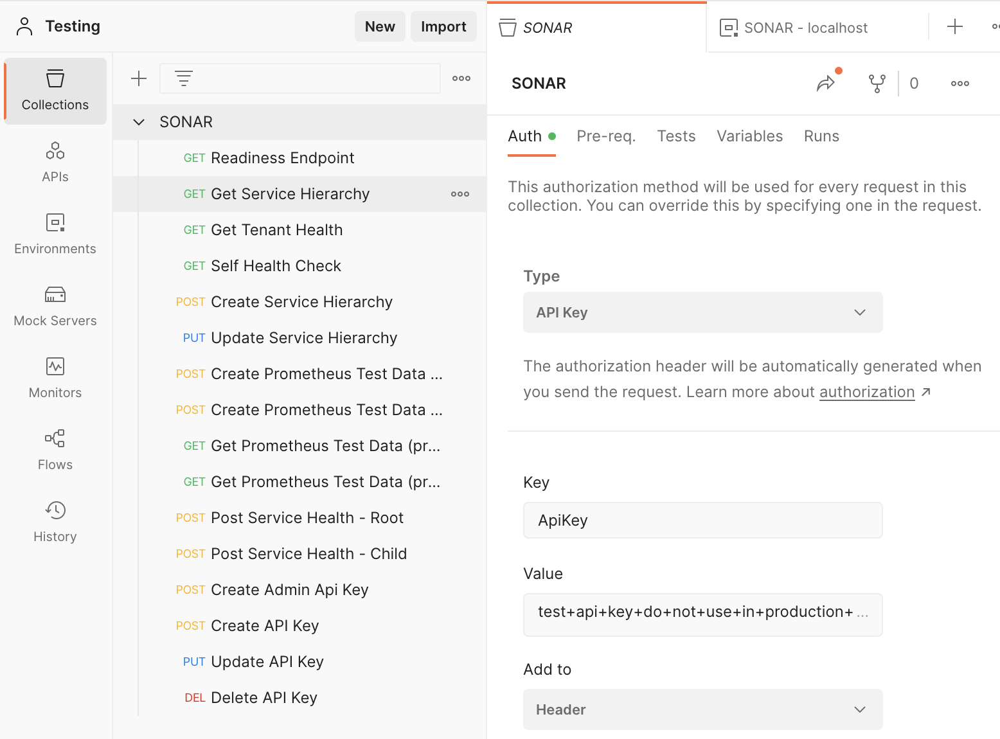
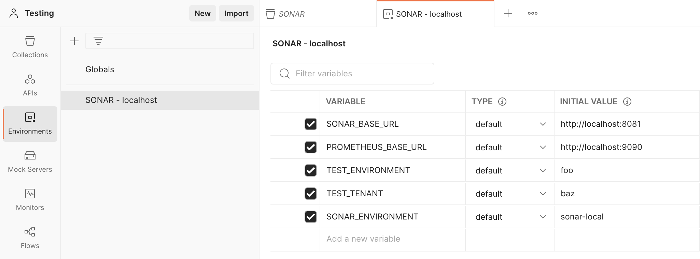
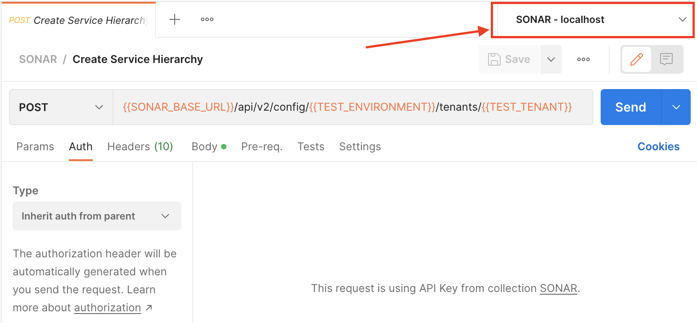

# SONAR API

## Launch Profiles

Launch profiles configure how dotnet starts the project when using `dotnet run` by default the "Development" profile and environment settings will be used. To run with the "Production" environment settings and a Release build you can use:

```
dotnet run --launch-profile production
```

Additional shared launch profiles may be configured in [`launcSettings.json`](sonar-api/Properties/launchSettings.json)

## Live Reloading

To run the API with live reloading while doing active development use:

```
dotnet watch run -- serve
```

_Note: When using live reloading, code changes to the application start up code will not automatically take effect, so if you change code invoked during application startup you will still need to force reload with `Ctrl+R`_

## Database Connectivity

The SONAR API requires connectivity to a PostgreSQL database. There is a [`docker-compose.yml`](docker-compose.yml) file that can be used to run PostgreSQL 14 for development purposes.

### Database Configuration

Configuration settings for the SONAR API database connectivity are defined in [`DatabaseConfiguration.cs`](sonar-api/Configuration/DatabaseConfiguration.cs). Values for the configuration settings defined in this file can be supplied via the `appsettings.{environment}.json` file for the applicable environment, environment variables, or command line arguments.

```shell
# Via environment variable:
Database__Port=1234 dotnet run --project sonar-api

# Via command line argument:
dotnet run --project sonar-api -- serve --Database:Port 1234
```

For more information see the ASP.Net [Core documentation](https://learn.microsoft.com/en-us/aspnet/core/fundamentals/configuration/?view=aspnetcore-6.0).

### Database Initialization

When starting the Sonar API with a fresh database, you must run the database migrations to initialize the database schema.

This only needs to be done when starting from a fresh database, or when new migrations have been added (see [Database Migrations](#database-migrations), below).

```shell
dotnet run -- migratedb
```

You can also force DB re-creation by adding the `--re-create`/`-r` flag:

```shell
dotnet run -- migratedb --re-create
```

### Database Query Logging

To run the SONAR API with SQL query logging enabled, run:

```
dotnet run -- serve --Database:DbLogging true
```

This should only be used in development environments, but it can be helpful for analyzing Linq query generation and performance.

### Database Migrations

Sonar API uses [EntityFramework Core](https://learn.microsoft.com/en-us/ef/core/) for interacting with it's backend database.

[EntityFramework Migrations](https://learn.microsoft.com/en-us/ef/core/managing-schemas/migrations/?tabs=dotnet-core-cli) are used for managing the database schema using the code-first approach (where the logical EF Core model in code is the source of truth for the data model, and the physical database schema is derived from entity model classes).

If you'll be modifying the data model for the Sonar API, you need to install the `dotnet-ef` CLI tool.

A reference to this tool is included in the `sonar-api` project configuration; run the following command to install it to your local environment:
```shell
# From within the sonar-api project folder
dotnet tool restore
```

From there, within the `sonar-api` project folder, you can then use the `dotnet ef` command to work with database migrations.

#### Updating the Data Model and Adding Migrations

When making changes to the Sonar API data model, use the following procedure:
1. Perform the necessary model changes in code, e.g.:
    - Add a field to an existing entity model class.
    - Add a new entity model class.
1. Add an EF migration for the model change, with a short descriptive name (using PascalCase, no spaces, up to 135 chars).
    - For example, let's say we added a `User.cs` entity model class; we'd add the migration with the following command:
    ```shell
    dotnet ef migrations add AddUserEntity # replace AddUserEntity with a descriptive name that captures your change
    ```
1. EF will automatically detect the change (via reflection and comparison to the current model snapshot), and will generate the relevant migration code in `sonar-api/Data/Migrations`.
    - Using the User entity change described above as an example, you'll see two new timestamped migration files:
        ```shell
        sonar-api/Data/Migrations/20230705134506_AddUserEntity.cs
        sonar-api/Data/Migrations/20230705134506_AddUserEntity.Designer.cs
        ```
        - The timestamps will reflect when you ran `ef migrations add` command; this is how EF maintains migration order.
        - You will also see that `sonar-api/Data/Migrations/DataContextModelSnapshot.cs` is automatically updated.
1. Review the generated EF database modification code to ensure the changes are what is intended.
    - There are some scenarios where EF doesn't generate the correct operations and you'll have to modify the generated migration code files manually.
    - One notable case is column renames; see the EntityFramework documentation about [column renames](https://learn.microsoft.com/en-us/ef/core/managing-schemas/migrations/managing?tabs=dotnet-core-cli#column-renames).
1. Apply the model changes to your local database; you can do this one of two ways:
    ```shell
    dotnet ef database update
    # OR
    dotnet run -- migratedb
    ```
1. Verify the changes work correctly.
1. If you need to back out the update (to make tweaks, or fix a typo or whatever):
    1. First downgrade the database to a previous migration:
        ```shell
        # List the previous migrations:
        dotnet ef migrations list
        # Copy the name of an appropriate migration, and downgrade to it:
        dotnet database update <name_of_previous_migration>
        ```
    1. Then remove the most-recently generated migration code:
        ```shell
        dotnet ef migrations remove
        ```
    1. Return to step 1 of this procedure.
1. Once you're happy with the changes, commit the two generated migration files, the updated snapshot, and your relevant code updates.

## Prometheus Protocol Buffers Types

The types defined in the `Protobuf/` folder are automatically generated using the `protoc` tool that is part of [Google.Protobuf.Tools package](https://github.com/protocolbuffers/protobuf/tree/main/csharp#usage). To regenerate these source files follow these steps:

```shell
# Initialize or update git submodules:
git submodule update --init

# Run the code generation msbuild task:
dotnet msbuild -target:generate_prometheus_types
```

## Authentication

All API endpoints that create, modify, or delete resources require authentication.

### API Key Authentication

Authentication can be performed using an API Key which is specified via the `ApiKey` HTTP Header. SONAR API can be configured to use a default Admin API key, either using the `ApiKey` environment variable, or the `"ApiKey"` entry in an `appsettings` file. Additional API keys can also be created via the [ApiController](./Controllers/ApiKeyController.cs).

Api Keys can be scoped to a particular Environment or a particular Tenant, which limits what operations they can perform.

## Testing with Postman

There is a [Postman](https://www.postman.com/) collection included in this repository, [`/docs/sonar.postman_collection.json`](../docs/sonar.postman_collection.json), which can be used to test the SONAR API. The requests in this collection are parameterized with `{{VARIABLE}}` templates which are populated based on values specified in your Postman Environment. A [sample environment](../docs/sonar-localhost.postman_environment.json) for testing on localhost has also been included. This collection also has authentication settings so that you can globally configure the API Key to use for testing, and all the requests that require authentication will inherit this setting.





When you are executing a request it is important to have to correct environment selected:


